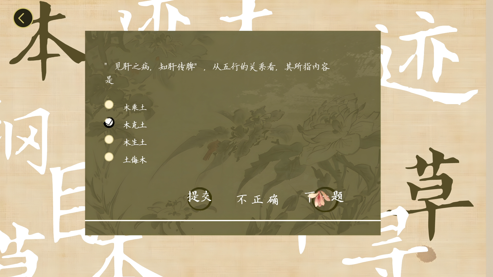

# 寻迹·本草前后端

## 介绍
该项目前端主要部分使用jQuery库，axios，parallax实现，后端使用SpringFramework 2.5.0实现。该项目参考了**本草纲目大全集高清手绘白话版**，[食疗本草](https://so.gushiwen.cn/guwen/book_46653FD803893E4FB5E4ECF6EB1D2DB6.aspx)，[中医基础理论](https://www.zysj.com.cn/lilunshuji/jichulilun/index.html)，前端BGM为[未闻花名](https://www.bilibili.com/video/BV1K54y1X77A)，以及[神女劈观](https://www.bilibili.com/video/BV1K44y1L7uP)。

## 注意
该项目所用药材图片文件夹需要放在项目同盘的根目录下(Windows)，根目录下(Linux)。

## 效果图

